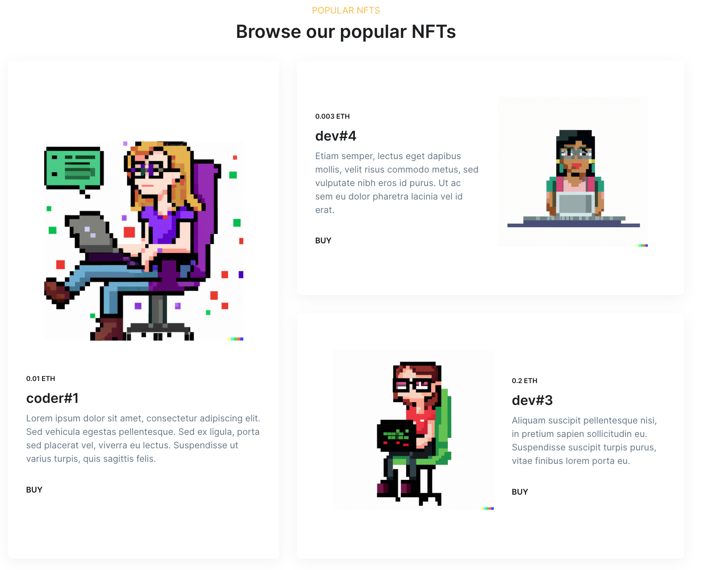
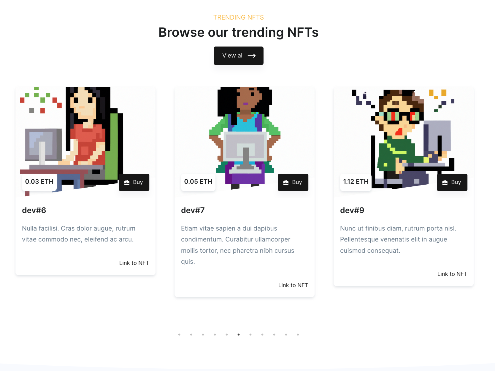
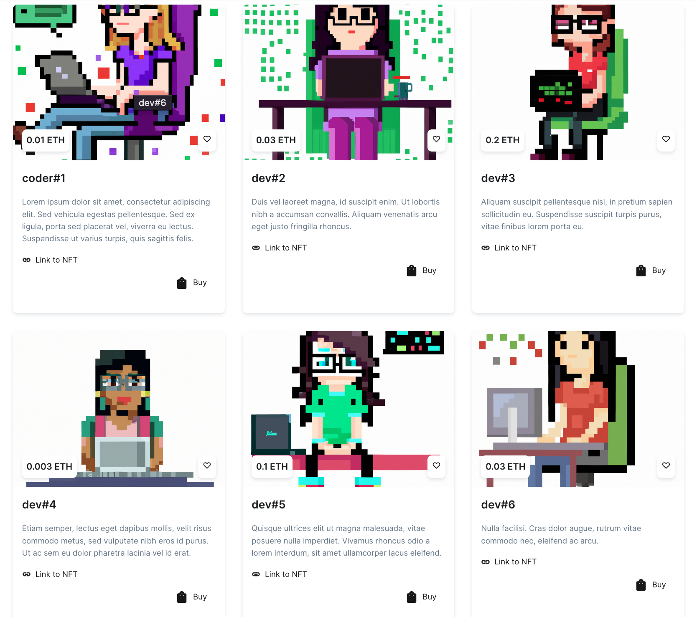
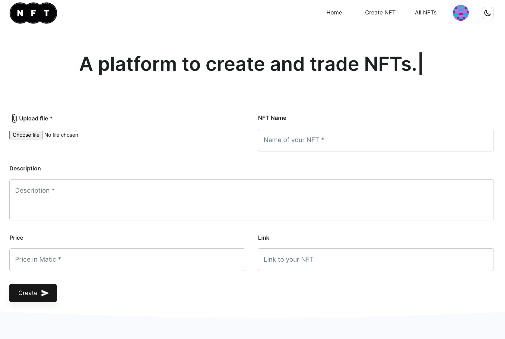

<br />
<div align="center">
  <a href="#">
    
  </a>

  <h3 align="center">NFT Marketplace</h3>
  <a href="https://marketplace-46f99.web.app/">Link</a>

</div>

<!-- ABOUT THE PROJECT -->

## About The Project

<p align="left">
    An awesome marketplace to turn your products or services into publicly tradeable items.
</p>

#### Network

Contract is deployed on Polygon mumbai network

```sh
Marketplace Address: 0xFC825b8f07E465c32b199Ecf5b0f3B679A4285b0
RPC URL: https://rpc-mumbai.maticvigil.com
```

https://mumbai.polygonscan.com/address/0xFC825b8f07E465c32b199Ecf5b0f3B679A4285b0

### ⚙️Functions:

- Web3 auth using metamask🦊/walletconnect/coinbase
- Create & list tokens for sale
- Using IPFS for uploading the file📁
- Marketplace owner can set platform fee
- Buyer can purchase token and list it again for sale

</img>
</img>
</img>
</img>

<p align="right">(<a href="#top">back to top</a>)</p>

### Built With

- [Next.js](https://nextjs.org/)
- [Material UI](https://mui.com/)
- [Hardhat](https://hardhat.org/)
- [Solidity](https://docs.soliditylang.org/)

<p align="right">(<a href="#top">back to top</a>)</p>

